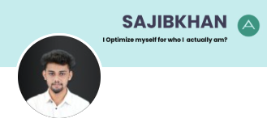

<!-- Remember README file can understand HTML Tag -->

<p align='center'>Markdown Syntax</p>

---

<!-- Heading Syntax Start -->
### Heading:

# This is Heading One.
## This is Heading Two.
### This is Heading Three.
#### This is Heading Four.
##### This is Heading Five.
###### This i Heading Six.
<!-- Heading Syntax Start -->


<!-- Paragraph Syntax Start -->
### Paragraph:
this is normal text. i am from paragraph. i am using to understand to give some information. so you can read me.
<!-- Paragraph Syntax End -->


<!-- Link Syntax Start -->
### Live Link:
https://sajibkhan.vercel.app/

### Disible Link:

`https://sajibkhan.vercel.app/`

### Short Link:

[sajibkhan](https://sajibkhan.vercel.app/)

### Short Link With Array:

[facebook][facebook]
[linkedin][linkedin]

[facebook]: https://www.facebook.com/
[linkedin]: https://www.linkedin.com/feed/
<!-- Link Syntax End -->


<!-- Image Syntax Start -->
### Image:

<!-- Image Syntax End -->


<!-- List Syntax Start -->
### Ordered List:
1. Item One

       1.Item1.1

       2.Item1.2

       3.Item1.3
2. Item Two
3. Item Three

### Unordered List:

- Item One

      item one.1
      item one.2
    
- Item Two
- Item Three

### Task List:

- [x] Task1
- [x] Task1
- [] Task1

<!-- List Syntax End -->


<!-- Italic Syntax Start -->
### Italic:
_This is an italic text_
<!-- Italic Syntax End -->


<!-- Bold Syntax Start -->
### Bold:
**This is an Bold text**
<!-- Bold Syntax End -->


<!-- space Syntax Start -->
<!-- double enter -->
<!-- space Syntax End -->


<!-- Blockquotes Syntax Start -->
### Blockquotes:
> This is a blockquote.
> This is a blockquote.
<!-- Blockquotes Syntax End -->


<!--  Code Syntax Start -->
### Single line code:
`<h1> Markdown Language </h1>`
<!--  Code Syntax End -->


<!--  Horizontal rule Syntax Start -->
---
<!--  Horizontal rule Syntax End -->


<!--  Code Block Syntax Start -->
### Double line code:
```
  <html>
  <head> </head>
  <body> </body>
  </html>
```
### html:
```html
<html>
  <head> </head>
  <body></body>
</html>
```
### css:
```css
head {
  background-color: green;
}
```
### javascript:
```javascript
console.log("hello");
```
<!--  Code Block Syntax End -->


<!--  Emoji Syntax Start -->
### Emoji:
😀 ❤️
<!--  Emoji Syntax End -->


<!--  Table Syntax Start -->
### Table:

| ID:         | Title:                  | Email:  |
| ------------| ----------------------  | --------
| 01          | Sajib khan              | sajibkhan.cit.bd@gmail.com|
| 02          | Sajib khan              | sajibkhan.cit.bd@gmail.com|
| 03          | Sajib khan              | sajibkhan.cit.bd@gmail.com|

<!--  Table Syntax End -->


